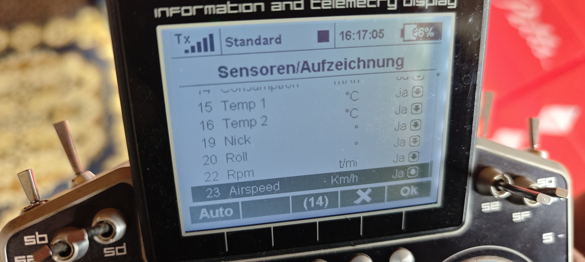
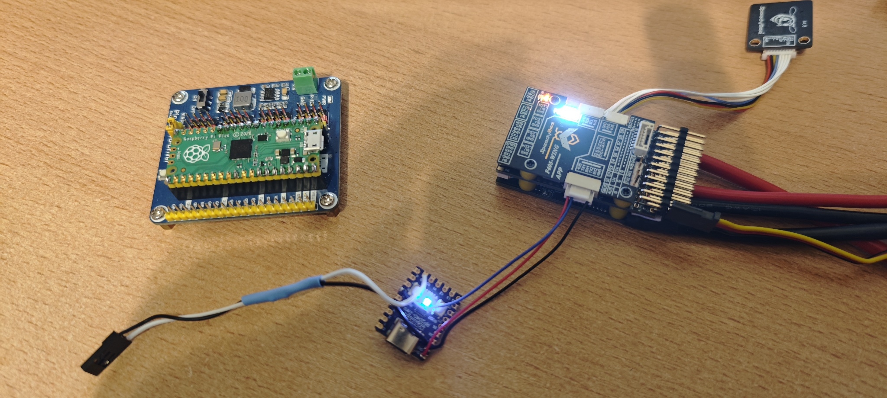

# FRSKY S.Port to HOTT, Multiplex, Jeti Exbus Converter (RP2040)

Die hier vorgestellte Lösung ermöglicht die Übertragung von Telemetriewerten von 
S.Port Sensoren zu Multiplex oder Jeti REX Empfängern.

Es wird ein kleines Zero Board (Waveshare RP2040-Zero) benötigt, das mit einem Widerstand zwischen
dem Telemetrie-Eingang des Empfängers und dem Telemetrieausgang des Sensors eingefügt wird.

Zur Konfiguration des Boards wird dieses mit einem USB Kabel an einem PC angeschlossen.
Es öffnet sich ein Windows-Explorerfenster. In dieses kopiert man die entsprechende 
.uf2 Datei aus dem Ordner Config und das wars!

Also ein sehr überschaubares Projekt!

**[Diskussion auf RC-Network](https://www.rc-network.de/threads/jeti-inav-keinen-%C3%9Cbertragung-der-telemetriewerte.12125914/)**  

## Hier der erste Musteraufbau

*Der Konverter auf dem Bild ist ein Musteraufbau, der eigentliche Konverter hat die Größe einer Briefmarke*

[Zur Lösungsbeschreibung](Doku/Lösung.md)

[Zum physikalischen Aufbau](Doku/Aufbau.md)

[Zur INAV Konfiguration](Doku/INAV.md)

[Zur JETI Konfiguration](Doku/Jeti.md)

[Zum USB MENUE des Konverters](Doku/Konverter.md)

[Zum orginalen OPENXSENSOR on RP2040 Projekt](Doku/oxs.md)

